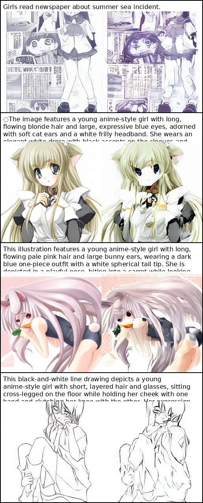

# MMDiT T2V (VTP tokenizer) — minimal training scaffold

This repo is a **minimal, scalable** text-to-video diffusion training scaffold built around:

- **VTP** as the visual tokenizer (recommended: `VTP-S-f16d64`) — see [MiniMax-AI/VTP](https://github.com/MiniMax-AI/VTP)
- A **factorized video transformer** (spatial window attention + temporal attention) so you can scale to longer clips
- A staged workflow: **latent cache → pretrain (generic) → post-train (anime domain) → LoRA**

> ! Important: This scaffold is designed for **correctness-first** iteration. Start at 256-ish resolution and short frame counts, then scale.

## Example Result

This is the output after training with 10k images for 100k steps.



---

## 0) Project flow (high-level)

1) **Install + configure**: install deps, set VTP repo/checkpoint, choose text encoder.
2) **Prepare metadata**: build JSONL for frames (T2V) or images (T2I).
3) **Cache latents**: `cache_vtp_latents` (video) or `cache_vtp_images` (image).
4) **Train**: run `mmdit.scripts.train_t2v` with `--train_cache_dir`.
5) **Inspect outputs**: checkpoints in `runs/<experiment_name>/checkpoints/`, samples in `runs/<experiment_name>/samples/` (if enabled).

## 0.5) Git submodules (optional)

If you manage external repos (e.g., `VTP/`, `HDM/`) as submodules:

```bash
git submodule update --init --recursive
```

Fresh clone with submodules:

```bash
git clone --recursive <REPO_URL>
```

## 1) Install

```bash
python3 -m pip install -r requirements.txt
```

### Optional: HuggingFace text encoder

If you want real text semantics (recommended after the pipeline is verified), install:

```bash
python3 -m pip install transformers
```

### VTP install (tokenizer)

VTP is a separate project and (currently) is typically used by **downloading/cloning the repo** and adding it to `PYTHONPATH` (no `pip install .` packaging required).

```bash
git clone https://github.com/MiniMax-AI/VTP.git ./VTP
python3 -m pip install -r ./VTP/requirements.txt

# Option A: export PYTHONPATH
export PYTHONPATH=./VTP:$PYTHONPATH

# Option B: set tokenizer.repo_path in YAML config
```

Download a checkpoint (example: `VTP-S-f16d64`) and set `tokenizer.name_or_path` in your config.

---

## 2) Dataset format (frames on disk) — for T2V

To avoid video-decoding dependencies in the training loop, this project expects **pre-extracted frames**.

Create a `metadata.jsonl` with one sample per line:

```json
{"id":"clip_000001","frames_dir":"PATH_TO_FRAMES_DIR/clip_000001","caption":"a person is dancing"}
```

Each `frames_dir` contains frames like:

```
clip_000001/
  000000.png
  000001.png
  ...
```

Frames should already be at **16fps** (or your desired fps). During training you can sub-sample frames via `num_frames` and `frame_stride`.

---

## 3) Cache VTP latents (recommended)

Caching moves expensive tokenizer compute out of the training step and makes multi-GPU training much faster.

```bash
python3 -m mmdit.scripts.cache_vtp_latents \
  --config configs/t2v_vtp_256_smoke.yaml \
  --split train \
  --meta_jsonl PATH_TO_METADATA/train.jsonl \
  --out_dir PATH_TO_CACHE/train
```

This produces `*.pt` files containing:

- `latents`: `(F, H_lat, W_lat, D_lat)` (float16)
- `caption`: `str`

---

## 3b) T2I quick start (recommended first)

If you **don’t have video data yet**, you can verify the whole pipeline with **text-to-image** first.
This project treats T2I as “video with 1 frame” so it can reuse the same model/training loop.

### Image JSONL format

```json
{"id":"img_000001","image_path":"PATH_TO_IMAGE/000001.png","caption":"a cat"}
```

### Cache image latents with VTP

```bash
python3 -m mmdit.scripts.cache_vtp_images \
  --config configs/t2i_vtp_256_smoke.yaml \
  --split train \
  --meta_jsonl PATH_TO_METADATA/train_images.jsonl \
  --out_dir PATH_TO_CACHE/train_images
```

### Train T2I (reuses the same train script)

```bash
torchrun --nproc_per_node=4 -m mmdit.scripts.train_t2v \
  --config configs/t2i_vtp_256_smoke.yaml \
  --train_cache_dir PATH_TO_CACHE/train_images
```

---

## Flow Matching (optional)

If you want an **MMDiT/SD3-style** training objective, you can switch the trainer to **flow matching**:

- Set `train.objective: flow_matching`
- Add a `flow_matching:` section (path + time range)

Example config:

- `configs/t2i_vtp_256_flow_matching.yaml`

### Optional: generate a tiny test dataset from edges2shoes (no video needed)

If you already have the local parquet dataset at `~/pix2pix/pix2pix/edges2shoes`, you can extract a small subset:

```bash
python3 -m mmdit.scripts.prepare_edges2shoes_t2i --max_samples 512
```

This writes:

- images: `data/edges2shoes_t2i/images/*.png`
- JSONL: `data/edges2shoes_t2i/train_images.jsonl`

---

## Aspect-ratio bucketing (multi-AR training)

This scaffold supports **training with mixed aspect ratios** (e.g. portrait + landscape) via **bucketing**:

- Cache latents into subdirectories: `cache_dir/<WxH>/<id>.pt`
- Use a bucket-aware batch sampler so each batch has a consistent latent H/W

### 1) Enable bucketing in your YAML

Add a top-level `bucketing:` section:

```yaml
bucketing:
  enabled: true
  strategy: closest_ar
  buckets:
    - [256, 256]
    - [320, 224]
    - [224, 320]
    - [384, 192]
    - [192, 384]
```

Notes:

- **Bucket sizes must be divisible by `tokenizer.latent_f`** (default 16).
- `video.width` / `video.height` still control **sampling preview resolution** during training; they do not need to list every bucket.
- If you change the bucket list, **rebuild the cache** in a fresh directory (the dataset will raise if it detects duplicate IDs across buckets).

### Shifted crop (HDM-style) during caching

HDM reports that a **shifted square crop** strategy improves T2I training quality and efficiency on limited hardware. This project can apply a similar idea at cache time by using a **shifted/offset crop** instead of a strict center crop (and optionally producing multiple crops per image).

Reference: [HDM TechReport](https://raw.githubusercontent.com/KohakuBlueleaf/HDM/main/TechReport.md)

Add to your YAML:

```yaml
preprocess:
  # "center" (default) or "shifted"
  crop: shifted
  # Shift amount in [0, 1]. 0=center crop, 1=full shift range.
  shift_fraction: 1.0
  # Optional: cache multiple shifted crops per image (increases dataset size on disk).
  num_crops: 2
  # Seed for deterministic crop selection per image/crop_idx.
  seed: 42
```

### 2) Cache (T2I example)

```bash
python3 -m mmdit.scripts.cache_vtp_images \
  --config configs/t2i_vtp_256_flow_matching_anime_buckets.yaml \
  --split train \
  --meta_jsonl PATH_TO_METADATA/train_images.jsonl \
  --out_dir PATH_TO_CACHE/train_images_buckets
```

### 3) Train

```bash
torchrun --nproc_per_node=4 -m mmdit.scripts.train_t2v \
  --config configs/t2i_vtp_256_flow_matching_anime_buckets.yaml \
  --train_cache_dir PATH_TO_CACHE/train_images_buckets
```

## 4) Train (DDP)

Single node, 4 GPUs:

```bash
torchrun --nproc_per_node=4 -m mmdit.scripts.train_t2v \
  --config configs/t2v_vtp_256_smoke.yaml \
  --train_cache_dir PATH_TO_CACHE/train
```

Outputs:

- checkpoints: `runs/<experiment_name>/checkpoints/`

---

## 5) Next steps (your target: 16fps, 5s, 720p+)

Practical path:

- **Pretrain (staged)**:
  - Stage A1: `448x256`, `num_frames=16`, `stride=5` (covers ~5s span cheaply) → `configs/t2v_vtp_256_smoke.yaml`
  - Stage A2: `448x256`, `num_frames=32`, `stride=2` → `configs/t2v_vtp_256_32f.yaml`
  - Stage A3: `448x256`, `num_frames=80`, `stride=1` → `configs/t2v_vtp_256_80f.yaml`
- **Post-train (anime)**: keep tokenizer + text encoder frozen at first; tune the denoiser on your anime dataset.
- **LoRA**: inject LoRA into attention/MLP projections for fast domain adaptation and character/style packs.
- **720p+**: do it in two stages: **base T2V** at 256-ish + **video super-resolution diffusion** to 720p.

---

## License / Credits

Tokenizer: [MiniMax-AI/VTP](https://github.com/MiniMax-AI/VTP)


